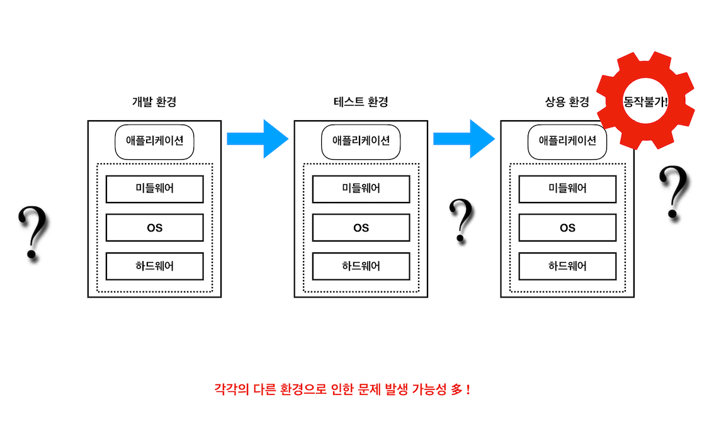

### 1.Docker 란?


- 가상으로 같은 베이스 이미지로 띄우기 때문에 동일한 실행 보장


- 컨테이너로 띄우면 여러 기능을 나눌 수도 있고 기본적으로 좀 가벼운 느낌이 크다.

### 2. Docker 도입하는 이유

- 서버가 이것저것 띄워져있으면 관리하기가 매우 어렵다. (개인적인 생각 일 수도 있음. 난 어려움..)
- 배포 횟수가 많아질 경우 개발 & 테스트가 어렵다.
- 도커를 이용할 경우 통합 테스트 환경 구축 및 배포 환경 자체를 매우 간결하게 할 수 있다.
- 실제로 써보면 테스트 / 배포가 엄청 편하고 빠름 (실제로 배포는 쿠버네티스에서 하긴하지만)

### 3. Docker의 특징

- 컨테이너 가상화 환경에서 에플리케이션을 관리하고 실행하기 위한 오픈소스 플랫폼
- 이식성이 좋다. 기존의 Waterfall 개발 환경에서는 테스트 / 상용 운영 환경에 따라 제대로 동작하지 않는 경우가 발생
- 도커의 경우, 애플리케이션 실행에 필수적인 모든 파일 및 디렉토리를 통째로 컨테이너에 담아 Docker Image 형태로 관리한다.
- 도커 이미지는 도커를 설치할 수 있는 환경이라면 어디든 동작이 가능하기 때문에, 운영환경에 따라 동작을 하지 않는 리스크가 적다.
- 추가로 여러개의 컨테이너를 띄워 통합 테스트 환경 구축이 아주 쉽다.
- 이러한 이미지는 Docker hub 또는 private docker registry 를 구축해서 관리할 수 있다. (nexus3 같은거)


### 4. Dokcer의 기본 기능
- Docker 이미지 : 컨테이너 실행에 필요한 파일과 설정값 등을 포함하고 있는 것 (정적 파일임. 윈도우 CD라고 생각하면 편함)
- Docker 이미지 생성 : Docker는 애플리케이션 실행에 필요한 프로그램, 라이브러리, 미들웨어와 OS, 네트워크 설정 등을 모두 모아서 이미지 생성
- Docker 컨테이너 동작 : Docker는 리눅스 상에서 컨테이너 단위로 서버를 구동시킨다. 하나의 이미지로 여러개의 컨테이너 실행 쌉가능


### 5. Docker 도입 As-is & To-Be

#### As-Is


```
위의 이미지에서 보면 예를들어 개발환경마다 리눅스 os 가 다르거나, 미들웨어가 다르거나 하면, 같은 소스로 배포를 해도 
의도하지 않았던 에러가 발생할 수 있다. (찾기 매우매우매우매우매우 어려움)
```

#### To-Be


```
도커로 띄우면, 도커 이미지 내에 있는 설정들로만 컨테이너가 생성되기 때문에, 개발환경이 다르건 말건 자기 혼자 설정하고
컨테이너가 뜨고 이래서 문제가 될 확률이 현저하게 줄어든다.
```

### 6. Docker Commands
- 커맨드가 많은데 굳이 정리하기보단 공홈 참조가 나을것 같다.

### 7. Dockerfile
- 도커는 이미지를 만들기 위해 Dockerfile 이라는 파일에 자체 DSL 언어를 이용하여 이미지 생성 과정을 거친다.

#### 자바 Dockerfile 예시

```sh
# 1. 베이스 이미지 설정
FROM adoptopenjdk/openjdk8

# 2. 작성자 같은 정보 설정
LABEL maintainer="gwamgtae park <abcd@def.com>"

# 3. ARG 설정
ARG WAR_FILE

# 4. 프로젝트내 WAR 파일을 도커 이미지 내에 app.war라는 이름으로 통째로 복사 
COPY target/${WAR_FILE} app.war

# 5. 기타 환경변수 설정
ENV LC_ALL=C.UTF-8
ENV JAVA_OPTS="-server"
ENV GC_OPTS="-XX:+UseG1GC -verbose:gc -XX:+PrintGCTimeStamps -Xloggc:gc.log"
ENV ADDITIONAL_PROPERTIES=""
# JAVA_TOOL_OPTIONS: -XX:+UnlockExperimentalVMOptions -XX:+UseCGroupMemoryLimitForHeap will be automatically picked up by adoptopenjdk

# 6. 쉘 실행 Entrypoint 작성
ENTRYPOINT ["sh", "-c", "java $JAVA_OPTS $GC_OPTS -Djava.security.egd=file:/dev/./urandom -jar /app.war $ADDITIONAL_PROPERTIES"]
```

### 8. Docker Compose
- docker-compose.yaml
- 여러개의 컨테이너 설정 내용이 저장된다.
- 컨테이너간 링크 연결 / 컨테이너간의 통신 / 컨테이너 데이터관리 / 컨테이너 환경변수 설정이 가능하다.
- docker compose 를 사용하면, 작성된 대로 여러개의 컨테이너가 구동 / 중지 / 재기동이 가능하다.
- 로컬 환경에서 상용 환경과 거의 동일하게 통합 테스트가 가능하다.
- mysql 같은거 올릴때 매우 좋음


```
위의 그림은 도커 컴포즈로 띄운 프로젝트 예시. 저런식으로 nginx / front / back 3개의 컨테이너를 띄워서 상용과 유사한 환경을 만들 수 있다.
카프카도 떠있음. 저런식으로 db를 띄워 데이터를 동일하게 맞춰 테스트가 가능하다.
```

### 9. After docker

- 실제로 도커를 상용환경에서 이용하긴 어렵다.
- 서버가 수십, 수백대가 되면 각각의 컨테이너를 명령어를 때려서 띄우고 내리고가 어렵다.
- 그래서 나온게 도커 오케스트레이션 툴인데, 요즘엔 쿠버네티스가 짱짱맨.
- 쿠버네티스도 도커 이미지를 사용하니까 결국 도커는 잘 알아놔야 되는건 마찬가지이다.
