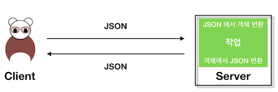
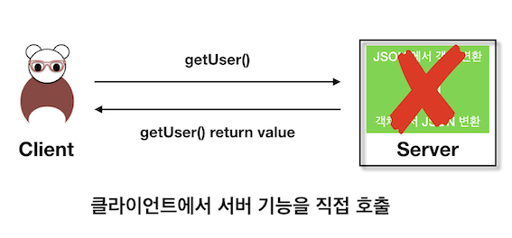
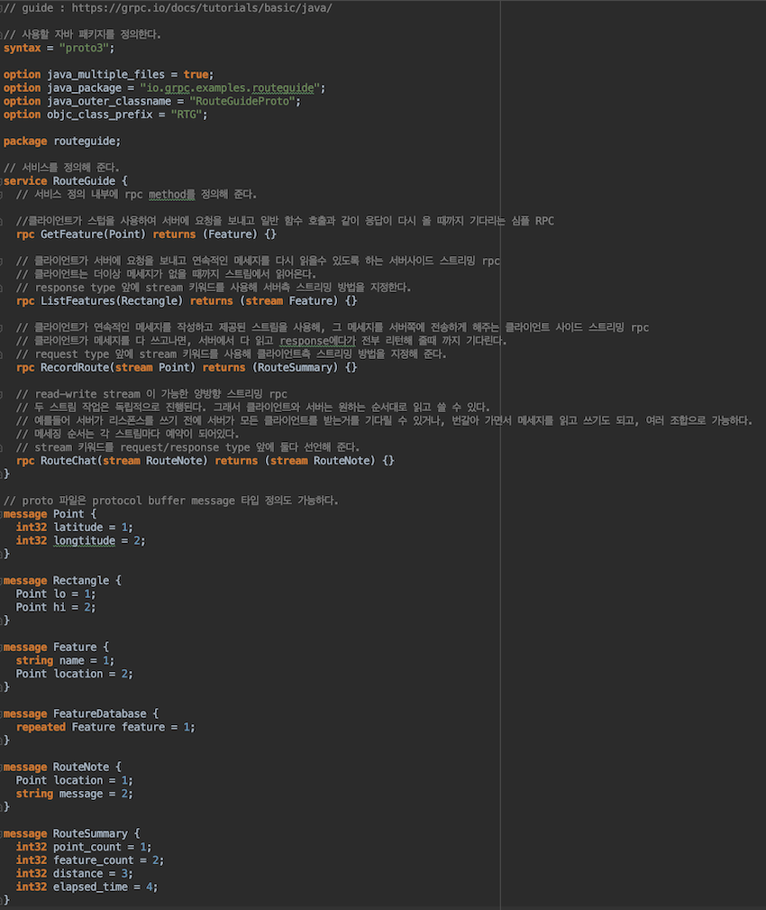
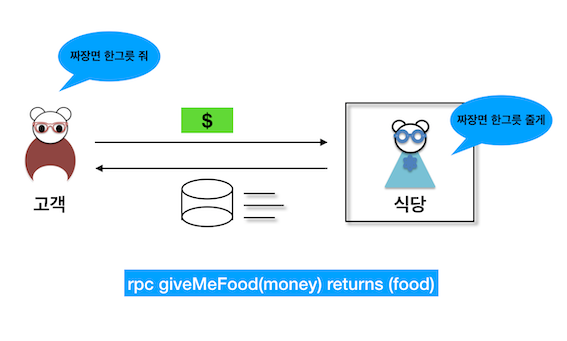
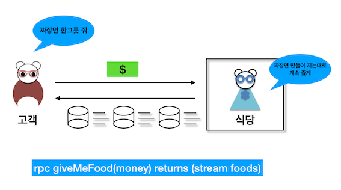
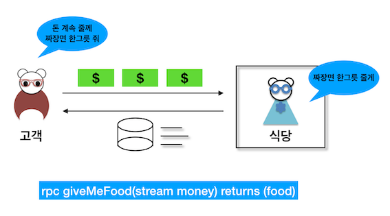
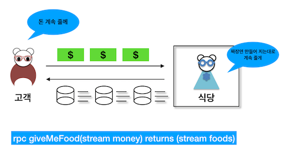

### gRPC vs Rest

Rest 통신 방식은 url 을 통해 호출을 하면 서버로 JSON 같은 형식으로 서버로 들어가고,

서버에선 JSON 을 컨버팅해 객체로 만들어 가공 및 작업 후 다시 JSON 형식으로 클라이언트로 보내준다.



이런 귀찮은 작업 없이 바로 클라이언트에서 서버에 있는 기능을 바로 쓸 수 있게 하는 방식이 *RPC* 방법이다.



RPC 기술을 쉽게 쓰라고 나온 기술이 구글에서 만든 gRPC 이다.

### gRPC 사용하기

기본적으로 gRPC를 사용할 때 .proto 파일을 생성을 해줘야 한다.

만들어진 proto파일을 protoc로 자동 생성을 하면, 서버 기본 베이스 클래스나, 클라이언트의  stub 객체같은 기능들이 포함된 클래스들을 만들어준다.

클래스 자동 생성 명령어 : protoc -I helloworld helloworld/helloworld.proto --go_out=plugins=grpc:helloworld

proto 파일 구조는 다음과 같다.



service 는 실제 생성될 메소드 모음이다.

[**메소드**]

- rpc {method 명} (input parameter) returns (output parameter) {} 로 정의하고.

[**객체**]

- message { ... } 로 정의한다.


메소드 설명 주석을 좀 마구잡이로 해석해놔서.. 간단하게 그림으로 설명하면

#### 1. 클라이언트 요청 - 서버 응답 (1:1)



#### 2. 클라이언트 요청 - 서버 스트림 응답 (1:N)



#### 3. 클라이언트가 스트림 요청 - 서버 응답 (N:1)



#### 4. 둘 다 스트림 형식으로 던지는 방식 (N:N)



출처 : [gRPC 공식 홈페이지 튜토리얼](https://grpc.io/docs/tutorials/)

### Java에서 gRPC 사용하기

#### 1. 일반적인 gRPC용 클라이언트 - 서버 어플리케이션 작성 방법
- service / message를 .proto 파일에 생성 (경로 : src/main/proto/)
- protocol buffer compiler를 통해 소스 생성
- 서버 어플리케이션 소스 작성
- 클라이언트 어플리케이션 소스 작성 

#### 2. Maven Dependency

```xml
<dependency>
        <groupId>io.grpc</groupId>
        <artifactId>grpc-netty</artifactId>
        <version>1.16.1</version>
    </dependency>
    <dependency>
        <groupId>io.grpc</groupId>
        <artifactId>grpc-protobuf</artifactId>
        <version>1.16.1</version>
    </dependency>
    <dependency>
        <groupId>io.grpc</groupId>
        <artifactId>grpc-stub</artifactId>
        <version>1.16.1</version>
</dependency>
```

```xml
<build>
  <extensions>
    <extension>
      <groupId>kr.motd.maven</groupId>
      <artifactId>os-maven-plugin</artifactId>
      <version>1.6.1</version>
    </extension>
  </extensions>
  <plugins>
    <plugin>
      <groupId>org.xolstice.maven.plugins</groupId>
      <artifactId>protobuf-maven-plugin</artifactId>
      <version>0.6.1</version>
      <configuration>
        <protocArtifact>
          com.google.protobuf:protoc:3.3.0:exe:${os.detected.classifier}
        </protocArtifact>
        <pluginId>grpc-java</pluginId>
        <pluginArtifact>
          io.grpc:protoc-gen-grpc-java:1.4.0:exe:${os.detected.classifier}
        </pluginArtifact>
      </configuration>
      <executions>
        <execution>
          <goals>
            <goal>compile</goal>
            <goal>compile-custom</goal>
          </goals>
        </execution>
      </executions>
    </plugin>
  </plugins>
</build>
```

#### 3. proto 파일 작성
- 기본 config 작성
- message structure 정의
- service 정의

#### 4. 프로토콜 버퍼로 소스 컴파일
- protoc -I=$SRC_DIR --java_out=$DST_DIR $SRC_DIR/HelloService.proto
- maven package

#### 5. 서버 소스 구성
- service로 자동 생성된 Base 소스를 상속받아, 필요한 메소드를 오버라이딩 해준다.

#### 6. 클라이언트 소스 구성
- stub을 생성해 클라이언트용 소스를 구성

소스 : [gRPC-java 샘플](https://github.com/gwegwe1234/gRPC-example/tree/master/javaGrpc)

출처 : [gRPC 공식 사이트 자바 샘플](https://grpc.io/docs/languages/java/basics/)

### Go에서 gRPC 사용하기

자바 gRPC 사용 법과 거의 동일하다.

차이점으로는 따로 gRPC 라이브러리를 가져올 필요없이, 소스를 작성하면 mod에서 자동으로 grpc 라이브러리를 추가 해준다.

#### 1. proto 파일 작성
- 기본 config 작성
- message structure 정의
- service 정의

#### 2. 프로토콜 버퍼로 소스 컴파일
- protoc -I helloworld helloworld/helloworld.proto --go_out=plugins=grpc:helloworld

#### 3. 서버 소스 구성
- proto 파일에서 생성된 인터페이스를 구현해서 서버 소스를 작성한다. 

#### 4. 클라이언트 소스 구성
- New{service명}Client 로 stub을 만들고, 메소드 호출을 하도록 클라이언트 소스를 구성한다.

소스 : [gRPC-go 샘플](https://github.com/gwegwe1234/gRPC-example/tree/master/goGrpc/example/helloworld)

출처 : [gRPC 공식 사이트 Go 샘플](https://grpc.io/docs/languages/go/basics/)